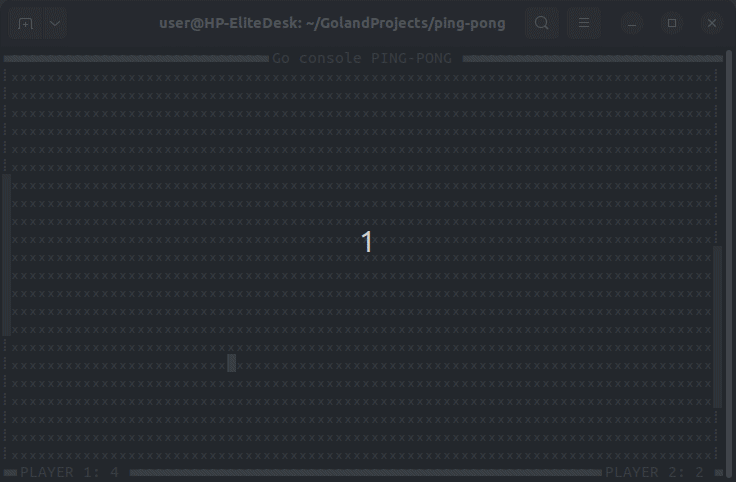

## Go console ping-pong

It's the console game written by me just for fun, don't take it seriously.  
The game is better to run on the Linux OS, it works on Windows too but stutters too much.  
Two players can play this game against each other. This is the only game mode.  



## Build

```bash
git clone github.com/Riznyk01/Go-console-ping-pong
cd Go-console-ping-pong
```  
```bash
make build
```
for Windows OS:
```bash
make buildwin
```  
Install pkg-config and alsa if needed:  
```bash
sudo apt install pkg-config
sudo apt install libasound2-dev
```

## Game Controls

- **Player 1**:
    - Move Up: Up arrow key
    - Move Down: Down arrow key

- **Player 2**:
    - Move Up: W key
    - Move Down: S key
  
## Known Issues

- Issue 1: If a player holds down a button, the buttons of the other player do not work.  
If both players press their buttons shortly, everything is okay.
- Issue 2: A Windows OS console with a running game stutters too much.  
 It is recommended to run the game on Linux.

## Gratitude  

Thanks to the authors of the sounds used in this project.  

https://freesound.org/people/pera/sounds/32510/  
https://freesound.org/people/Krokulator/sounds/652615/  
https://freesound.org/people/michorvath/sounds/269718/  
https://freesound.org/people/Joao_Janz/sounds/482653/  